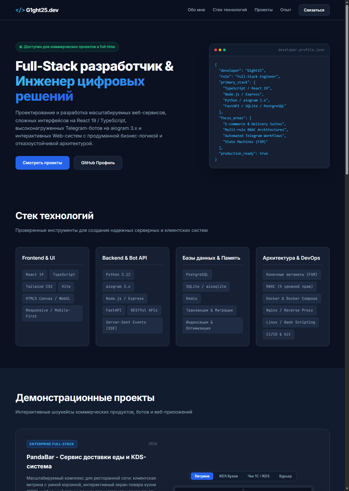
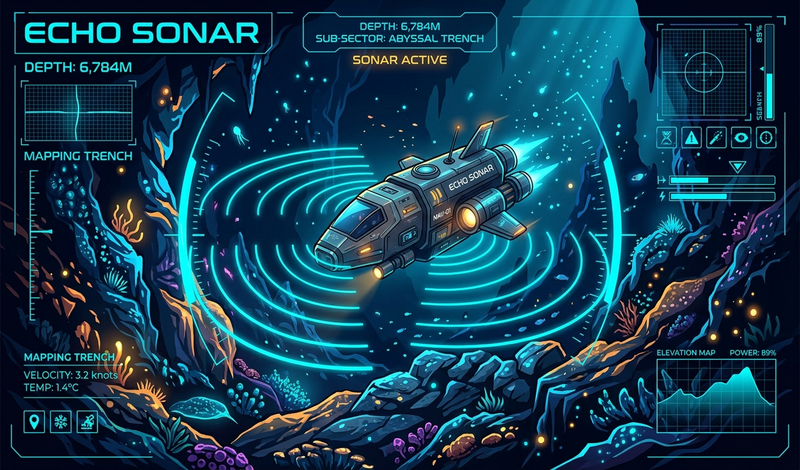

# G1ght25 - Developer Portfolio & Projects Showcase

Открытый репозиторий портфолио проектов и резюме Full-Stack разработчика. В репозитории собраны готовые коммерческие решения, сложные веб-платформы, асинхронные боты и интерактивные приложения.

---

## Визуальный обзор проектов



Веб-версия с интерактивными мокапами устройств и живой игрой:  
**https://g1ght25.github.io/developer-portfolio/**

---

## Ключевые проекты

### 1. PandaBar - Платформа доставки еды и KDS-система


Полнофункциональный веб-сервис для ресторанных сетей доставки:
- **Витрина для клиентов:** умный каталог блюд с разделением на сеты, роллы и напитки; студийные фотографии блюд высокого разрешения; шкала прогресса бесплатной доставки (порог 1000 рублей); интерактивный выбор соусов и приборов; звуковое сопровождение оформления заказа (ASMR).
- **Экран повара (KDS):** контрастный интерфейс для кухни с карточками активных чеков, таймерами готовки и управлением стоп-листом блюд.
- **Экран курьера:** оптимизированный для мобильных устройств интерфейс приема и доставки готовых заказов.
- **Панель управляющего и Администратора:** финансовая аналитика, расчет Food Cost, учет складских остатков, управление мастер-PIN кодами и ролями сотрудников.
- **Безопасность и архитектура:** 5 ролей (RBAC), серверная валидация стоимости без возможности подмены клиентом, конечный автомат заказов (pending -> confirmed -> cooking -> ready -> delivering -> completed).

---

### 2. Telegram Portfolio & Business Bot

Асинхронный Telegram-бот на aiogram 3.x с 4 готовыми бизнес-сценариями:
- **E-commerce модуль:** каталог товаров, динамическая корзина, расчет сумм и пошаговый чекаут.
- **Модуль бронирования:** выбор услуги, даты и времени с проверкой слотов и подтверждением.
- **Калькулятор сметы IT-услуг:** интерактивный опросник для сбора лидов и мгновенного расчета стоимости.
- **Админ-панель:** сводная статистика, управление заявками и массовая рассылка по пользователям.

---

### 3. Echo Sonar - HTML5 Canvas игра



Браузерная аркада на чистом JavaScript для платформы Яндекс Игры:
- Математический рендеринг звуковых волн и отражений на Canvas 2D.
- Процедурная генерация аудиоэффектов через Web Audio API.
- Интеграция с Yandex Games SDK.
- Доступна для запуска прямо внутри интерактивного портфолио.

---

## Технологический стек

- **Frontend:** TypeScript, React 19, Tailwind CSS, Vite, Motion, HTML5 Canvas, Web Audio API
- **Backend:** Python 3.12, Node.js, Express, aiogram 3.x, FastAPI, REST API, Server-Sent Events (SSE)
- **Базы данных:** PostgreSQL, SQLite (aiosqlite), Redis
- **Архитектура:** Машина состояний (FSM), Ролевая модель доступа (RBAC), Микросервисы, Docker
- **Инструменты:** Git, Linux, Bash, Nginx, Postman

---

## Структура репозитория

```text
developer-portfolio/
|-- index.html                 # Интерактивное веб-портфолио и резюме с мокапами
|-- style.css                  # Стили интерфейса (мокапы устройств, темная тема)
|-- app.js                     # Клиентская логика интерактивных экранов
|-- assets/
|   |-- screenshots/           # Скриншоты и графические материалы для README
|   `-- 3d/crystal.obj         # 3D-модель (Wavefront OBJ)
|-- pandabar/                  # Комплекс доставки еды и KDS (React 19 + TypeScript + Node.js)
|   |-- src/                   # Компоненты витрины, корзины, KDS и админки
|   |-- server.ts              # Серверный API (Express + SQLite + RBAC)
|   `-- package.json           # Зависимости и скрипты запуска
|-- telegram-bot/              # Коммерческий Telegram-бот (Python + aiogram 3.x + SQLite)
|   |-- bot.py                 # Логика 4 бизнес-модулей и панели администратора
|   |-- database.py            # Асинхронный слой работы с БД (aiosqlite)
|   `-- requirements.txt       # Зависимости Python
`-- games/
    `-- echo-sonar/            # Атмосферная HTML5 игра (Canvas 2D + Web Audio)
```

---

## Быстрый локальный запуск

### Запуск веб-сервиса PandaBar:
```bash
cd pandabar
npm install
npm run dev
```
Сервис будет доступен по адресу `http://localhost:5173`.

### Запуск Telegram-бота:
```bash
cd telegram-bot
pip install -r requirements.txt
cp .env.example .env
# Укажите ваш BOT_TOKEN и ADMIN_ID в файле .env
python bot.py
```

### Запуск интерактивного портфолио:
Откройте файл `index.html` в любом браузере, либо активируйте GitHub Pages в настройках репозитория (`Settings` -> `Pages` -> `Branch: main` -> `Save`).

---

## Контакты разработчика

- **GitHub:** [https://github.com/G1ght25](https://github.com/G1ght25)
- **Специализация:** Full-Stack разработка (React / Node.js / Python)
- **Готовность к сотрудничеству:** Открыт для предложений по разработке проектов любой сложности.